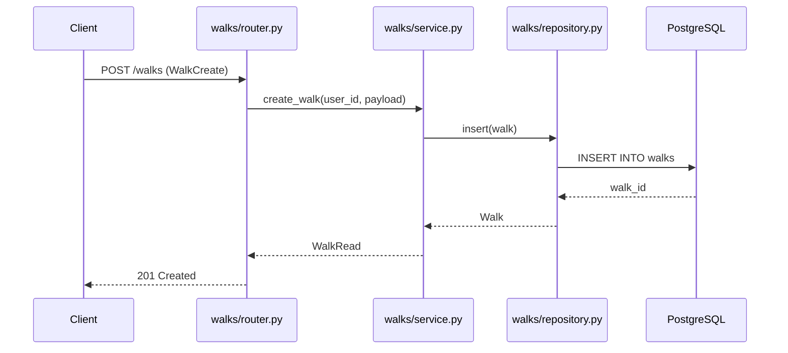
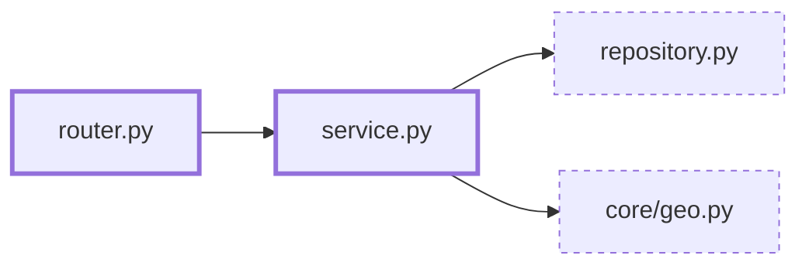
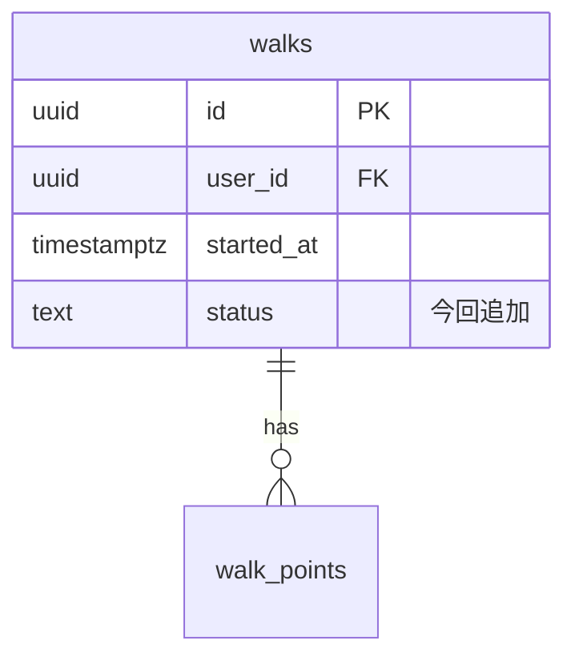
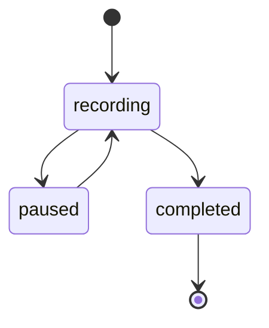

# 図の描き方

## 図を描く判断基準

**描く**:

- 呼び出しが3階層以上に及ぶ(router → usecase/service → repository → 外部API など)
- 複数のモジュールをまたぐデータの流れがある
- DBスキーマが変わる(既存データへの影響がある)
- 状態遷移が増えた・変わった
- 非同期処理・並行処理・リトライがある

**描かない**:

- 1ファイル内で完結する変更
- 素直な CRUD の1本道
- 文章で3行で説明できること

図はコストが高い(生成にも読解にも)。「文章より速く伝わるか」だけで判断する。

## 幻覚を防ぐ制約(必須)

- 図に登場する**関数名・クラス名・引数名は、diff またはソースに実在するものだけ**を使う。
- 図の直後に**対応表**を置き、各ノードの `file:line` を示す。これが書けないノードは図に入れない。
- 引数・戻り値の型は、確認した箇所だけ書く。推測で埋めない。

## レシピ

### 1. 呼び出し連鎖と引数 — `sequenceDiagram`

API のエントリポイントから複数サービスが呼ばれるケースの既定形。

| ノード | 実体 |
| --- | --- |
| `walks/router.py` | `packages/backend/src/sanposcape/walks/router.py:34` |
| `walks/service.py` | `packages/backend/src/sanposcape/walks/service.py:52` |

エラー経路がある場合は `alt` / `opt` で分岐を描く。正常系だけの図は、
「例外時にどうなるか」というレビュー観点を隠してしまう。

### 2. モジュール依存 — `flowchart`

新規は太線、既存は破線で区別する。「今回どこが増えたか」が一目で分かる。

### 3. スキーマ変更 — `erDiagram` + 影響メモ

図の下に必ず添える:

- **既存データへの影響**: NOT NULL 制約を付けたか / default は何か / 既存行はどう埋まるか
- **ロールバック可否**: downgrade でデータが失われるか
- **インデックス**: 追加したか、既存クエリに効くか

### 4. 状態遷移 — `stateDiagram-v2`

「今回追加された遷移」と「到達不能になった状態」を注記する。

### 5. テスト観点 — 表(図ではない)

テストは図より表が読みやすい。

| # | テスト観点 | 対象 | 期待 | スタブ/モック手法 |
| --- | --- | --- | --- | --- |
| 1 | 未認証で拒否される | `POST /walks` | 401 | `app.dependency_overrides` で認証依存を差し替え |
| 2 | 他人の walk は取得できない | `GET /walks/{id}` | 404 | fixture で別ユーザーのレコードを作成 |

表の後に必ず書く:

- **カバーされていない観点**: 追加されたコードのうち、テストが触れていない分岐
- **スタブの妥当性**: 本物と挙動がズレるリスクがある差し替えをしていないか
